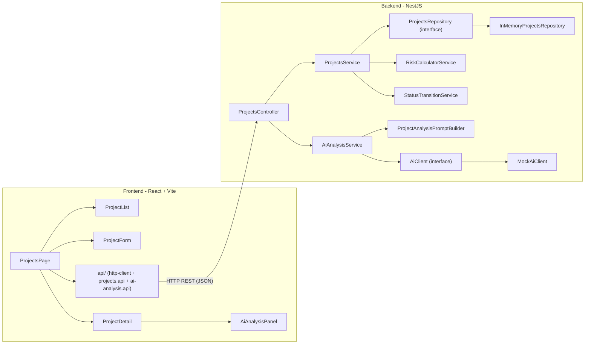
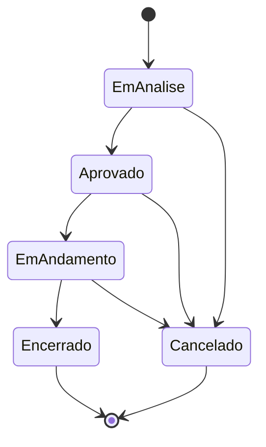
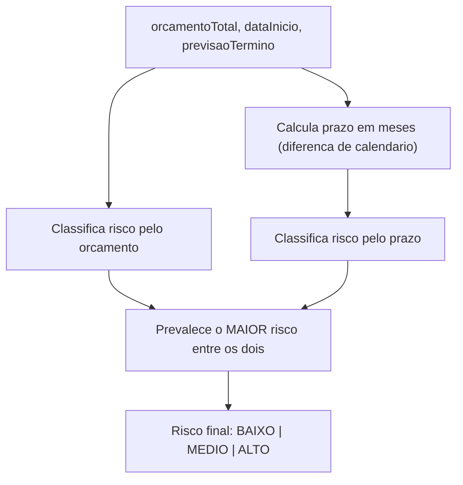
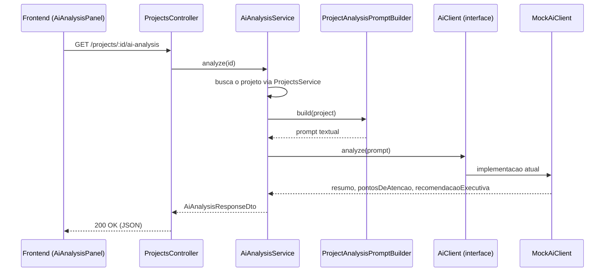
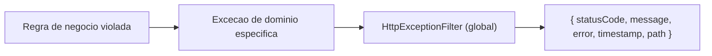

# Arquitetura

Este documento complementa o [`README.md`](README.md) com uma visão mais visual da arquitetura da solução: como as camadas se conectam, como o status e o risco são controlados, e como a análise de IA está desacoplada do resto do sistema.

## Visão geral dos componentes

Pontos-chave:

- O frontend nunca acessa dados diretamente; tudo passa pela camada `api/`, que fala com o backend via REST.
- O `ProjectsController` não contém lógica de negócio — ele delega para `ProjectsService` (regras de CRUD, status, risco) e para `AiAnalysisService` (análise de IA), mantendo a separação exigida pelo desafio.
- `ProjectsRepository` é uma interface. A única implementação hoje é `InMemoryProjectsRepository`, mas o `ProjectsService` não conhece esse detalhe — poderia receber uma implementação com banco real sem mudar uma linha de regra de negócio.
- `AiClient` segue o mesmo princípio: é uma interface. Hoje aponta para `MockAiClient`; no futuro, poderia apontar para um client de uma API de LLM real.

## Fluxo de transição de status

Regras aplicadas pelo `StatusTransitionService`:

- Todo projeto nasce em `EmAnalise`.
- Cada status só pode avançar para o próximo da sequência (`EmAnalise → Aprovado → EmAndamento → Encerrado`); não é possível pular etapas.
- `Cancelado` pode ser atingido a partir de qualquer status que não seja `Encerrado` ou `Cancelado`.
- `Encerrado` e `Cancelado` são estados finais, sem transições de saída.
- Exclusão (`DELETE /projects/:id`) é bloqueada quando o status é `EmAndamento` ou `Encerrado`.

## Fluxo de cálculo de risco

Disparado automaticamente pelo `ProjectsService` sempre que um projeto é criado, ou atualizado alterando orçamento, data de início ou previsão de término. Implementado como função pura em `RiskCalculatorService`, sem efeitos colaterais, o que permite testá-lo isoladamente (`risk-calculator.service.spec.ts`).

## Fluxo da análise assistida por IA

Essa separação em camadas atende ao requisito do desafio de que "a chamada ou simulação da IA não deve estar diretamente no controller". Trocar `MockAiClient` por uma implementação real (ex.: uma API de LLM) exige apenas:

1. Criar uma nova classe que implemente `AiClient`.
2. Registrar essa classe no provider `AI_CLIENT` em `ai-analysis.module.ts`.

Nenhuma outra camada (`ProjectsController`, `AiAnalysisService`, `ProjectAnalysisPromptBuilder`) precisa ser alterada.

## Tratamento de erros

Cada regra de negócio violada lança uma exceção de domínio específica (`ProjectNotFoundException`, `InvalidStatusTransitionException`, `ProjectDeletionNotAllowedException`), capturada pelo filtro global (`HttpExceptionFilter`) e traduzida para um formato de erro HTTP padronizado, consumido de forma consistente pelo frontend.
